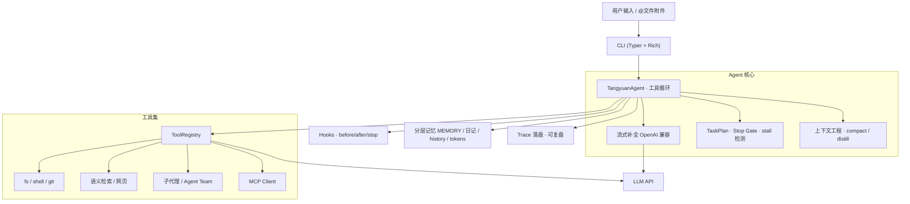

<div align="center">

# 汤圆 Tangyuan

**从零自研的终端通用 Agent** · A general-purpose coding & task agent in your terminal

在终端里对话，让 Agent 自主规划、调用工具、读改代码、跑命令、搜网页——独立实现的多工具闭环，不依赖任何 Agent 框架。

[](LICENSE)
[](https://www.python.org/downloads/)
[](https://github.com/lichenyu666/tangyuan/actions/workflows/ci.yml)
[](https://github.com/astral-sh/ruff)

[快速开始](#快速开始) · [架构设计](#架构设计) · [工程亮点](#工程亮点) · [完整文档](docs/ARCHITECTURE.md)

</div>

---

## 这是什么

汤圆是一个 **约 7500 行 Python** 的终端 Agent 框架，兼容任意 OpenAI 风格接口（DeepSeek / 通义 / OpenAI / 本地网关）。它把「大模型 + 工具循环 + 记忆 + 安全边界」这套 Agent 核心能力**从底层自研实现**，而非调用 LangChain / LangGraph 等现成框架——目的就是完整走通并掌握一个生产级 Agent 的每一层。

```text
你：帮我看下这个仓库的结构，找出 apply_patch 的实现并解释
汤圆：[list_dir] → [search_codebase] → [read_file] → 流式给出解释
      并在需要时自动拆解任务、调用子代理、跨会话记住结论
```

## 核心特性

| 维度 | 能力 |
| --- | --- |
| **自主工具循环** | 单次任务最多 30 步的 ReAct 式循环；流式输出边想边说 |
| **35+ 内置工具** | 文件读写 / `apply_patch` 精准改码 / 受控 shell / git / 语义检索 / 网页搜索抓取 / PPT 生成 |
| **上下文工程** | 会话自动压缩（超阈值归档旧轮次）+ 项目结论蒸馏，长对话不爆 token |
| **结构化任务规划** | `update_plan` 任务板 + Stop Gate 门禁：计划没做完不许收工，空转自动纠偏 |
| **子代理 & 多智能体** | `explore / research / coder` 子代理独立上下文；可派生队友、收发消息、广播 |
| **分层长期记忆** | 全局画像 / 项目笔记 / 按日日记 / 对话历史 / Token 计量，跨会话可召回 |
| **RAG 检索增强问答** | 对任意文档目录检索相关片段，让 LLM 依据它作答并给出可核查的引用出处 |
| **Skills 渐进披露** | 系统提示只放技能摘要，命中意图后再按需加载全文，省 token |
| **MCP 协议** | 内置 stdio MCP Client 与 time server，可扩展外部 MCP 生态 |
| **可插拔 Hooks** | 输出截断 / 写操作审计 / 计划收工门禁，围绕工具生命周期扩展 |
| **安全边界** | 交互二次确认、危险命令硬拦截、写操作限定 workspace、只读 Plan 模式 |

## 架构设计



工程分层（`tangyuan/`）：

```text
agent/     Agent 核心循环、任务计划、子代理、Agent Team   (~1.3k 行)
tools/     工具注册与实现：fs/shell/git/search/mcp/...     (~2.7k 行, 最大模块)
memory/    分层记忆存储与召回                              (~570 行)
rag/       RAG 检索增强问答：检索 + 生成 + 引用
skills/    Skill 渐进披露加载器 + 内置剧本
mcp/       stdio MCP 客户端 + 内置 time server
hooks/     工具/停止生命周期钩子
prompts/   人设/准则/压缩/蒸馏提示词 + 组装器
ui/        Rich 终端渲染与主题
eval/      20 例端到端评测（隔离 workspace + 断言）
cli.py     命令行入口与交互 REPL
```

> 更细的模块职责、Agent 循环时序与设计取舍见 **[docs/ARCHITECTURE.md](docs/ARCHITECTURE.md)**。

## 工程亮点

这个项目刻意覆盖了一个「真实可用的 Agent」需要处理的硬问题：

- **上下文不爆**：实现会话压缩（旧轮次 LLM 摘要归档）+ 项目蒸馏（提炼稳定事实入库），而不是简单截断历史。
- **不半途而废**：`PlanStopGateHook` 在模型想结束时检查未完成任务并阻断收工；`stall` 检测在连续 8 步无进展时注入纠偏提示。
- **精准改码**：`apply_patch` 支持基于上下文的补丁式编辑，而非整文件覆盖。
- **安全优先**：写操作限定 workspace、危险 shell（`rm -rf /`、`curl|sh` 等）硬拒绝、交互式二次确认、以及供公开演示用的只读工具白名单。
- **可观测**：每次运行落 `trace` JSONL，写操作留审计日志，Token 用量单独计量，方便复盘与成本分析。
- **抽象干净**：`ToolRegistry + ToolSpec(Pydantic)` 自动生成 OpenAI function schema；新增工具只需注册一个 spec + handler。

## 快速开始

```bash
git clone https://github.com/lichenyu666/tangyuan.git
cd tangyuan
python3 -m venv .venv
source .venv/bin/activate            # Windows: .venv\Scripts\activate
pip install -e .

cp .env.example .env                 # 填入 TANGYUAN_API_KEY / BASE_URL / MODEL
tangyuan                             # 进入交互式对话
```

常用姿势：

```bash
tangyuan run "总结当前仓库" -w .                 # 一次性任务
tangyuan plan "先摸清结构再给改动建议" -w .       # 只读 Plan 模式，产出 plan.md
tangyuan rag "什么是 RAG？" -w examples/rag_demo  # 检索增强问答（带引用）
tangyuan eval --skip-network                     # 跑内置评测集
tangyuan list-tools                              # 查看已装载工具
```

### RAG 检索增强问答

对一个文档目录提问，汤圆会先检索最相关的片段，再让 LLM **只依据这些片段作答**，
并在底部列出引用来源（文件:行号），找不到就明说「无法回答」以降低幻觉。

```bash
tangyuan rag "汤圆的记忆系统怎么分层？" -w examples/rag_demo
tangyuan rag "我的学习笔记里怎么讲索引的？" -w ~/notes   # 换成你自己的资料目录
```

检索优先用 embedding 向量（需 `TANGYUAN_EMBEDDING_*` 指向支持 embedding 的服务）；
若不可用则自动降级为**支持中文分词的文本检索**，所以即使用 DeepSeek 这类无 embedding
接口的网关也能开箱即用。实现见 [`tangyuan/rag/engine.py`](tangyuan/rag/engine.py)。

交互中可用斜杠命令：`/skills` `/skill <id>` `/memory` `/tokens` `/team` `/inbox` `/clear`。

## 配置

密钥只放本地 `.env` 或 `~/.tangyuan/.env`（已 gitignore，**绝不入库**）。

```bash
TANGYUAN_API_KEY=sk-xxx
TANGYUAN_BASE_URL=https://api.deepseek.com
TANGYUAN_MODEL=deepseek-chat
```

可选能力：`pip install -e '.[mcp]'`（MCP 生态）。完整变量见 [`.env.example`](.env.example)。

## 技术栈

`Python 3.10+` · `OpenAI SDK`（兼容各家接口） · `Typer` CLI · `Rich` 终端 UI · `Pydantic` / `pydantic-settings` 配置与 schema · `httpx` · `ddgs` 网页搜索 · `python-pptx` · 可选 `mcp` / `gradio`。

## 质量保障

- **CI**：GitHub Actions 每次 push / PR 运行安装、导入冒烟与单元测试
- **测试**：`pytest` 覆盖工具注册表、只读/演示白名单、任务计划校验、记忆路径等**无需 API Key 的纯逻辑**
- **Lint**：`ruff` 统一风格
- **类型**：全量 `from __future__ import annotations`，函数注解覆盖率高

```bash
pip install -e '.[dev]'
pytest -q
ruff check .
```

## 路线图

- [x] 自研工具循环 · 流式输出 · 会话压缩 / 项目蒸馏
- [x] 结构化任务计划（Stop Gate）· 子代理 · Agent Team · MCP · Hooks
- [x] 分层记忆 · Skills 渐进披露 · `apply_patch` 精准编辑
- [x] RAG 检索增强问答（检索 + 生成 + 引用，中文可用）
- [x] 端到端评测集 · CI · 单元测试
- [ ] RAG 升级：重排序（rerank）与多轮追问
- [ ] 更强权限模型与沙箱
- [ ] 评测成功率看板
- [ ] 在线 Demo / 云端托管

## License

[MIT](LICENSE) © li_chenyu ·  作者主页 [lichenyu.fun](https://lichenyu.fun) · 参与开发见 [CONTRIBUTING](CONTRIBUTING.md) · 安全策略见 [SECURITY](SECURITY.md)
