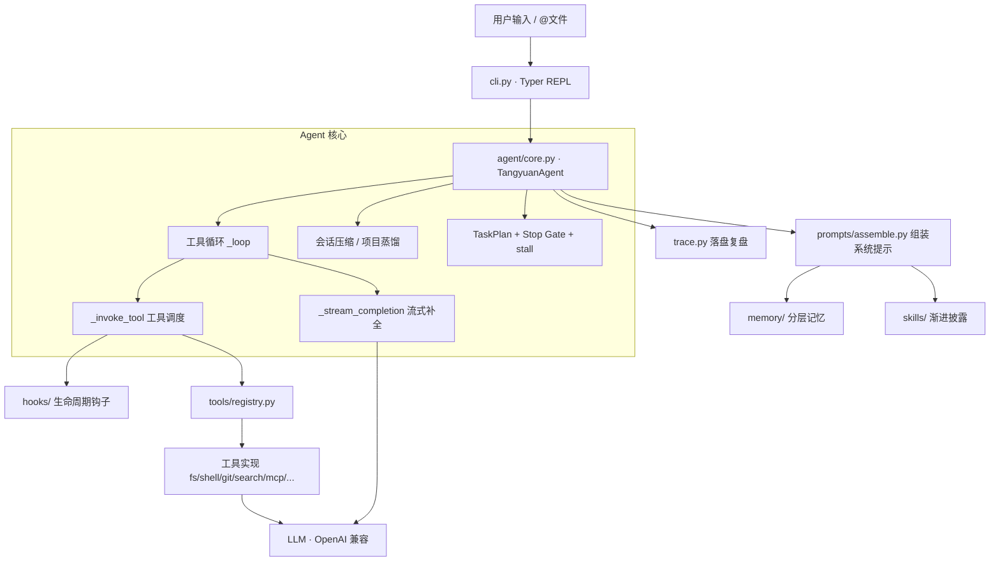
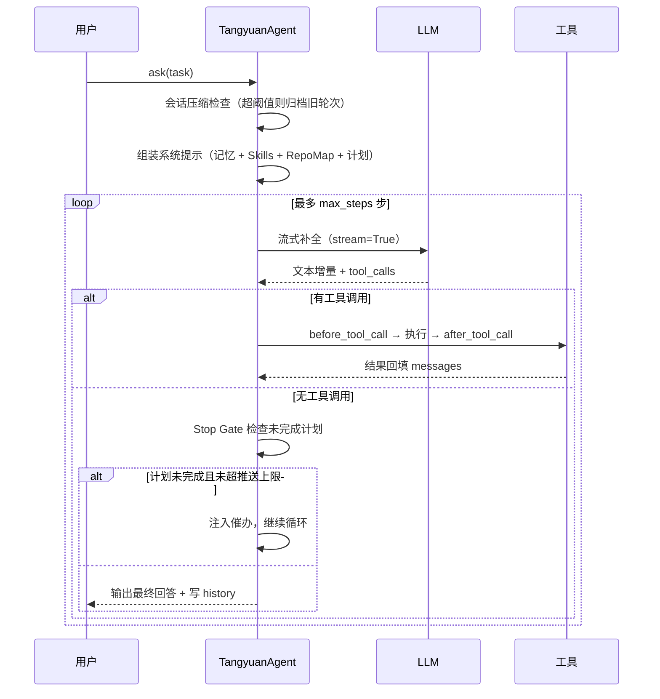

# 架构设计

本文说明汤圆各模块职责、Agent 单轮执行时序，以及几处关键设计取舍。目标读者：想快速评估工程能力的技术面试官，以及想二次开发的贡献者。

## 分层总览

## 模块职责

| 模块 | 职责 | 关键类型 / 文件 |
| --- | --- | --- |
| `agent/` | Agent 循环、任务计划、子代理、多智能体协作 | `TangyuanAgent`(core.py)、`TaskPlan`(plan.py)、`subagent.py`、`team.py` |
| `tools/` | 工具注册与实现，统一装配 | `ToolRegistry`/`ToolSpec`(registry.py)、`build_default_tools`(default.py)、`register_*.py` |
| `memory/` | 分层记忆存储与召回 | `store.py`、`paths.py`、`history.py`、`tokens.py` |
| `skills/` | Skill 发现与渐进披露 | `loader.py`、`catalog/*/SKILL.md` |
| `mcp/` | stdio MCP 客户端 + 内置 server | `MCPClient`、`servers/time_server.py` |
| `hooks/` | 工具/停止生命周期扩展点 | `HookRegistry`(base.py)、`builtin.py` |
| `prompts/` | 提示词模板与组装 | `assemble.py`、`SOUL/system/workspace/compact/distill.md` |
| `ui/` | Rich 终端渲染与主题 | `render.py`、`theme.py` |
| `eval/` | 端到端评测（隔离 workspace） | `runner.py`、`cases.py`、`assertions.py` |

## Agent 单轮执行时序

## 关键设计取舍

### 1. 上下文工程：压缩 + 蒸馏，而非截断
长对话会撑爆上下文窗口。汤圆在非 system 消息数或字符数超阈值时，用一次 LLM 调用把旧轮次压成一条摘要（`_summarize_session`），只保留最近若干轮；同时把「稳定结论」蒸馏进项目记忆（`distill_project_memory`），下次会话可 `recall_memory` 召回。相比朴素截断，既省 token 又不丢关键信息。

### 2. 结构化计划 + Stop Gate：对抗「假装做完」
仅靠提示词让模型「别偷懒」并不可靠。汤圆用 `TaskPlan` 维护结构化任务板，并在模型想结束时由 `PlanStopGateHook` 检查未完成项，`block` 掉收工、注入催办（有最大次数保护）；另有 `stall` 检测在连续多步无进展时提醒换路径。这把「不半途而废」变成可控的运行时机制。

### 3. 工具抽象：注册一个 spec + handler 即可扩展
`ToolSpec`（Pydantic）自动生成 OpenAI function schema，`ToolRegistry` 负责注册/卸载/调用并统一捕获异常返回结构化错误。新增工具无需改动核心循环；`read_only` 与公开 Demo 白名单通过「按需注册 + 卸载黑名单」组合得到不同权限档位。

### 4. 安全分层
- 写操作路径限定在 workspace；危险 shell（`rm -rf /`、`curl|sh` 等）硬拒绝
- 交互模式对 shell / 写操作二次确认（`-y` 关闭）
- Plan 模式只读；公开 Demo 进一步卸掉 shell / 写盘 / 子代理 / Team / MCP
- 写操作留审计 `hooks_audit.jsonl`，每轮运行落 `traces/*.jsonl`

## 可观测性

| 落盘 | 位置 | 用途 |
| --- | --- | --- |
| Trace | `<workspace>/.tangyuan/traces/run-*.jsonl` | 单轮完整事件流，便于复盘 |
| Hook 审计 | `<workspace>/.tangyuan/hooks_audit.jsonl` | 写操作留痕 |
| 对话历史 | `~/.tangyuan/memory/history.jsonl` | 跨会话事件流 |
| Token 计量 | `~/.tangyuan/memory/tokens.jsonl` | 成本分析（`/tokens` 汇总） |

## 测试与质量

- `tests/` 覆盖工具注册表、只读/Demo 白名单、任务计划校验、记忆路径等**无需 API Key 的纯逻辑**
- CI 在 Python 3.10 / 3.11 / 3.12 上运行 `ruff` + 导入冒烟 + `pytest`
- `eval/` 提供 20 例端到端评测（需 API Key，在隔离临时 workspace 内运行并断言产物）
